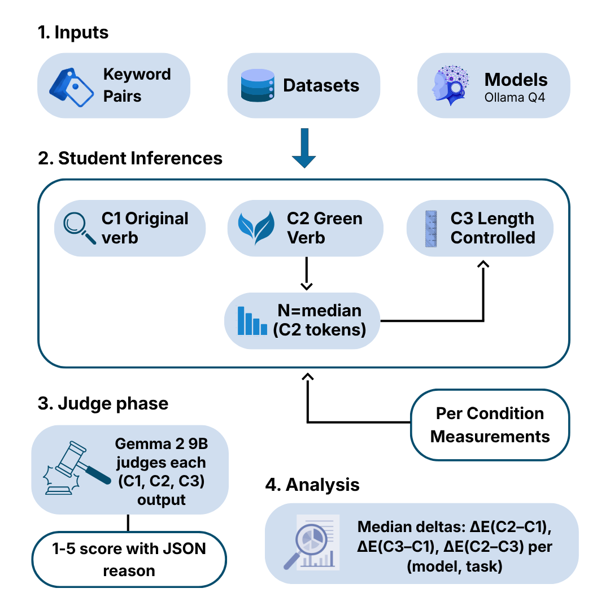

# GreenSwap: Verb Choice or Output Length?

> **A Controlled Decomposition of Prompt-Level Energy Savings in LLM Inference**
>
> *Anonymous ACL submission*

[](https://www.python.org/)
[](https://ollama.com/)
[](LICENSE)

---

## Overview

Swapping elaboration-triggering instruction verbs for compression-triggering alternatives has been reported to reduce LLM inference energy by up to 70%. But are these savings due to a genuine *lexical* effect, or simply because "green" verbs elicit shorter outputs?

**GreenSwap** answers this question with a controlled three-condition experiment across three open-weight models and three task types. Our key finding: **the verb effect is entirely length-mediated** (token–energy correlation r ≥ 0.998), and **explicit output-length instructions (C3) are Pareto-dominant** over verb-swapping in 8 of 9 model–task cells.

---

## Pipeline



The pipeline has four stages:

1. **Inputs** — 24 keyword pairs (8 per task) × 50 dataset items × 3 Ollama Q4 models
2. **Student Inferences** — each (model, pair, item) cell runs three conditions:
   - **C1 (Original verb):** high-energy Adamska verb in a fixed template
   - **C2 (Green verb):** same template with the verb swapped to a low-energy alternative
   - **C3 (Length-instructed):** same as C1, with `"Answer in N tokens or fewer"` appended, where `N = max(5, median(C2 tokens))` is derived at runtime
3. **Judge Phase** — Gemma 2 9B scores each (C1, C2, C3) output on a 1–5 rubric combining correctness and conciseness
4. **Analysis** — median energy deltas ΔE(C2–C1), ΔE(C3–C1), ΔE(C2–C3) per (model, task)

---

## Key Results

| Model | Task | ΔE C2 vs C1 | ΔE C3 vs C1 | Judge C1 | Judge C2 | Judge C3 |
|---|---|---|---|---|---|---|
| Qwen 2.5 7B | QA | −47.5% | −80.9% | 2.67 | 2.69 | **2.95** |
| Qwen 2.5 7B | Gen | −55.0% | −84.0% | 4.16 | 3.13* | **3.76** |
| Qwen 2.5 7B | Sent | −2.4% | −69.2% | 3.49 | 3.51 | **3.95** |
| Llama 3.1 8B | QA | −58.2% | −58.2% | 2.96 | 2.93 | **3.49** |
| Llama 3.1 8B | Gen | −66.6% | −48.0% | 3.49 | 2.46* | **3.72** |
| Llama 3.1 8B | Sent | −6.3% | −53.0% | 3.69 | 3.68 | **3.88** |
| Mistral 7B | QA | −41.4% | −66.5% | 2.59 | 2.62 | **2.90** |
| Mistral 7B | Gen | −29.4% | −42.3% | 3.94 | 3.73* | 3.88 |
| Mistral 7B | Sent | −5.1% | −38.5% | 3.50 | 3.59 | **3.78** |

\* C2 significantly worse than C1 (p < 0.001). All C3 bold values significantly better than C1 (p < 0.05, Holm–Bonferroni).

**Four headline findings:**

- **C3 is Pareto-dominant in 8 of 9 cells** — more energy savings and equal or better quality than C2
- **C2 is a strict Pareto improvement only on QA** (41–58% savings, no quality loss); it *degrades* quality on generation tasks by ~1.0 judge point
- **Token–energy correlation r ≥ 0.998** rules out any residual lexical effect — energy is a near-deterministic function of output length
- **Budget compliance varies 4-fold** across model families (Qwen ρ̃ = 0.35 vs Llama ρ̃ = 0.84), mechanistically explaining all model-dependent outcomes

---

## Repository Structure

```
GreenSwap/
├── greenswap_lib.py          # Shared library: loaders, inference, measurement, judge, lexical metrics
├── greenswap_keywords.csv    # 24 verb pairs (8 per task: QA, Generation, Sentiment)
├── _student_runner.py        # Reusable driver called by each student runner
├── run_student1.py           # Student 1: Qwen 2.5 7B (qwen2.5:7b-instruct-q4_K_M)
├── run_student2.py           # Student 2: Llama 3.1 8B (llama3.1:8b-instruct-q4_K_M)
├── run_student3.py           # Student 3: Mistral 7B v0.3 (mistral:7b-instruct-v0.3-q4_K_M)
├── run_judge.py              # Judge runner: Gemma 2 9B scores all student outputs
├── make_figures.py           # Figure generation (Figures 2–9 in the paper)
├── pipline.png               # Pipeline diagram
└── results/                  # Output directory (created at runtime)
    ├── raw_<slug>.csv        # Per-run measurements
    ├── summary_<slug>.csv    # Per-cell medians + deltas + judge scores
    ├── failures_<slug>.csv   # Any cell-level errors
    └── manifest_<slug>.json  # Run metadata
```

---

## Setup

### Prerequisites

- Python 3.10+
- [Ollama](https://ollama.com/) 0.4+
- A single consumer GPU with ≥ 8 GB VRAM (all experiments ran on this configuration)

### Install Python Dependencies

```bash
pip install ollama codecarbon datasets pandas tqdm scipy
```

### Pull Models

```bash
# Student models
ollama pull qwen2.5:7b-instruct-q4_K_M
ollama pull llama3.1:8b-instruct-q4_K_M
ollama pull mistral:7b-instruct-v0.3-q4_K_M

# Judge model
ollama pull gemma2:9b-instruct-q4_K_M
```

---

## Running the Experiment

### Step 1 — Start Ollama

```bash
ollama serve
```

### Step 2 — Run Student Inferences

Each script is independent and can be run in sequence or on separate machines. Each takes approximately 13–14 hours on an 8 GB consumer GPU.

```bash
python run_student1.py   # Qwen 2.5 7B  (~13.3 h, 7,200 inferences)
python run_student2.py   # Llama 3.1 8B (~13.3 h, 7,200 inferences)
python run_student3.py   # Mistral 7B   (~13.3 h, 7,200 inferences)
```

Each script writes to `results/`:

| File | Contents |
|---|---|
| `raw_<slug>.csv` | One row per individual inference run |
| `summary_<slug>.csv` | One row per (model, pair, item) cell — medians + energy deltas |
| `failures_<slug>.csv` | Cells that raised exceptions |
| `manifest_<slug>.json` | Hyperparameters and timing metadata |

### Step 3 — Run the Judge

```bash
python run_judge.py
```

This reads all `summary_*.csv` files in `results/`, scores every (cell, condition) output with Gemma 2 9B, and writes `judge_score`, `judge_reason`, and lexical metrics (`em`, `f1`, `accuracy`) back into the same files. Features automatic resume — safe to interrupt and re-run.

### Step 4 — Generate Figures

```bash
python make_figures.py
```

Reproduces Figures 2–9 from the paper.

---

## Configuration & Scaling

All defaults live in `greenswap_lib.py` and can be overridden per-runner:

| Parameter | Default | Description |
|---|---|---|
| `PAIRS_PER_TASK` | 8 | Verb pairs per task (set to 3 for a quick MVP) |
| `ITEMS_PER_DATASET` | 50 | Items per dataset (set to 3 for a quick MVP) |
| `RUNS_PER_CONDITION` | 2 | Runs per condition (median aggregated) |
| `NUM_PREDICT` | 512 | Max output tokens (student) |
| `NUM_CTX` | 2048 | Context window |
| `TEMPERATURE` | 0 | Greedy decoding |
| `SEED` | 42 | Reproducibility seed |
| `MIN_C3_BUDGET` | 5 | Floor for C3 length budget (prevents degenerate 1-token demands) |
| `JUDGE_MODEL` | `gemma2:9b-instruct-q4_K_M` | Cross-family judge |

To run a quick smoke test (3 pairs × 3 items):

```python
# In run_student1.py or directly:
from _student_runner import run_student
run_student("qwen2.5:7b-instruct-q4_K_M", pairs_per_task=3, items_per_dataset=3, runs_per_condition=1)
```

---

## Verb Pairs

All 24 pairs are drawn from Adamska et al. (2025a) Table II. The CSV `greenswap_keywords.csv` has columns: `pair_id`, `task_type`, `original_verb`, `green_verb`.

| ID | Task | Original (v_o) | Green (v_g) |
|---|---|---|---|
| Q01–Q08 | QA | justify, justify, analyse, analyse, measure, measure, create, explain | classify, translate, classify, translate, classify, write, classify, write |
| G01–G08 | Generation | analyse, analyse, recommend, recommend, measure, measure, report, report | classify, translate, classify, translate, classify, translate, classify, translate |
| S01–S08 | Sentiment | identify, identify, explain, explain, build, build, classify, classify | provide, summarize, provide, analyse, provide, summarize, provide, analyse |

Pairs Q03/G01, Q04/G02, Q05/G05 are cross-task replication pairs (same verb swap, different task).

---

## Datasets

| Task | Dataset | Split | Items |
|---|---|---|---|
| QA | TriviaQA (`rc.nocontext`) | validation | 50 |
| Generation | ELI5 via KILT | validation | 50 |
| Sentiment | SST-2 (GLUE) | validation | 50 |

All loaded via HuggingFace `datasets`. No private or personally identifiable data is used.

---

## Prompt Templates

**Student (QA / Generation):**
```
{Verb} the answer to the following question.
Question: {question}
```

**Student (Sentiment):**
```
{Verb} the sentiment of the following review as positive or negative.
Review: {text}
```

**C3 suffix** (prepended before the question/review field):
```
Answer in {N} tokens or fewer.
```

**Judge (QA / Generation):** 1–5 rubric where 1 = incorrect/irrelevant, 3 = correct but verbose, 5 = correct, concise, complete.

**Judge (Sentiment):** 1–5 rubric where 1 = wrong sentiment, 3 = correct but excessively elaborated, 5 = correct, very concise.

> **Rubric note:** The judge structurally advantages shorter outputs (score 3 = "verbose", score 4 = "reasonably concise"). Quality improvements for C3 should be read as "at least as correct, *and* more concise" rather than pure correctness gains. Lexical metrics (token F1, exact match, SST-2 accuracy) and a blind human evaluation (Cohen's κ = 0.83) serve as rubric-free corroborating signals.

---

## Budget Compliance (C3)

| Model | Median ρ | ρ < 0.5 | ρ > 1.0 |
|---|---|---|---|
| Qwen 2.5 7B | 0.35 | 84.7% | 0.7% |
| Llama 3.1 8B | 0.84 | 23.6% | 40.1% |
| Mistral 7B | 0.73 | 21.8% | 18.2% |

ρ = actual output tokens / prompted budget. Qwen severely under-shoots; Llama over-shoots on generation tasks. **Audit ρ̃ before deploying C3** and tune N accordingly.

---

## Practitioner Guidance

- **Default to explicit prompt-level length instructions (C3).** They save more energy than verb swapping and preserve or improve quality in 7 of 9 model–task cells. Where available, hard `max_tokens` API caps are even more reliable.
- **Use C2 verb swapping on QA-style tasks only.** It delivers a strict Pareto improvement (41–58% energy savings, no significant quality loss) on factoid QA.
- **Do not use C2 on long-form generation.** The ~67% energy savings come at the cost of a semantically different, lower-quality answer (confirmed by both the automated judge and blind human evaluation).
- **Audit compliance per model before deploying C3.** Qwen under-shoots its budget by 65%; Llama over-shoots by 53% on generation tasks.

---

## Reproducibility

| Item | Value |
|---|---|
| Hardware | Single 8 GB consumer GPU |
| Runtime | ~13.3 h per student model; ~5 h judge; ~40 h total |
| Software | Python 3.10+, Ollama 0.4+, CodeCarbon 2.3+, `datasets==2.21.0` |
| Determinism | `temperature=0`, `seed=42`, identical templates per task/condition |
| Total inferences | 21,600 student + 10,800 judge = 32,400 |
| Pipeline errors | 0 across all 3,600 cells |
| Truncation rate | 1.44% (all from C1 long-form outputs hitting `num_predict=512`) |
| Judge validity | 10,800 / 10,800 valid scores (0 invalid) |

---

## Citation

If you use GreenSwap in your research, please cite:

```bibtex
@article{greenswap2025,
  title   = {GreenSwap: Verb Choice or Output Length? A Controlled Decomposition of Prompt-Level Energy Savings in LLM Inference},
  author  = {Anonymous},
  journal = {arXiv preprint},
  year    = {2025}
}
```

---

## License

Released for scientific replication. All models and benchmarks used are publicly available open-weight / open-data resources. See individual dataset and model licenses for their respective terms.
